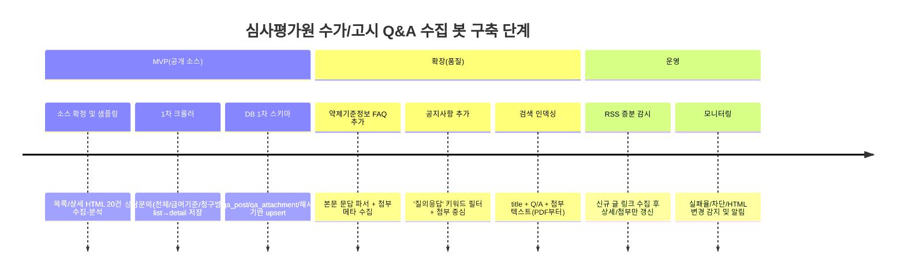

# 심사평가원 수가·고시 Q&A 데이터 수집을 위한 소스 분석과 수집 설계 PRD

## 핵심 요약

심사평가원 수가/고시 Q&A를 “봇으로 수집”하려면, **공개(비로그인) 소스**와 **기관회원 전용(로그인) 소스**를 분리해 접근 전략을 세우는 것이 출발점입니다. 공개 측면에서는 (1) 국민소통의 **상담문의 → 자주하는 질문(FAQ)** 게시판이 **규모(예: 457건/46페이지)**와 일일 업데이트(예: 2026-03-16 표기) 측면에서 가장 “Q&A형 데이터”에 가깝고, (2) 제도·정책 영역의 **약제기준정보(암질환 사용약제 및 요법 FAQ 등)**는 **전문 분야(약제/항암)**에 특화되어 Q&A 구조가 선명하며, (3) 기관소식 **공지사항**은 “Q&A 본문”보다는 **질의응답 PDF/HWP 첨부**로 핵심이 제공되는 경우가 많습니다. citeturn18view1turn13view2turn13view1

기관회원 전용 소스인 **요양기관업무포털(biz.hira.or.kr)**은 “법인용 인증서 기관회원 전용”으로 안내되며, 진료비 청구 등 요양기관 업무를 분리 운영하는 목적이 명확합니다. 따라서 포털의 “요양기관 전용 질의응답(1:1 문의 등)”은 **로그인 자동화/개인정보/약관 제한** 이슈가 커서, 원칙적으로는 **사전 협의·승낙 또는 공식 제공 방식(API/내부 export)** 없이 크롤링을 전제로 설계하면 리스크가 큽니다. citeturn25search0turn19view0turn20view1

실무적으로는 **1차 봇은 공개 Q&A(FAQ/공지사항 첨부 중심)만으로 MVP**를 만든 뒤, (a) RSS를 이용한 증분 갱신, (b) “고시/공고/수가코드” 매칭(법제처/국가법령정보 API는 보조), (c) 첨부파일(특히 PDF) 텍스트 인덱싱을 단계적으로 붙이는 접근이 안전합니다. citeturn13view3turn21view2turn20view1

다음은 바로 착수 가능한 **우선순위 체크리스트**입니다.

1) 공개 소스 2~3개(자주하는 질문/급여기준/청구방법/암질환FAQ/공지사항)를 확정하고, `pgmid`별로 “목록 URL 템플릿”을 기록한다. citeturn18view1turn28view0turn13view2turn13view1  
2) 각 소스의 **list → detail → attachments** 추출 규칙을 샘플 5~10건으로 고정한다(HTML 구조 변화 대비해 `raw_html` 저장 포함). citeturn13view0turn14view0turn13view1  
3) 첨부는 1차에 **URL/파일명/추정 타입만 저장**하고, 다운로드·텍스트추출은 2차 파이프라인으로 분리한다. citeturn13view1turn24search4turn24search5  
4) 약관/저작권·개인정보 처리 기준을 코드 정책으로 박아둔다(특히 로그인 자동화 금지/개인정보 배제). citeturn20view1turn20view0turn20view2  
5) `source + post_id(brdBltNo)` 기반으로 upsert 구조를 만들고, 변동 탐지를 위해 해시(본문/첨부목록)를 저장한다. citeturn13view0turn14view0turn13view1  
6) RSS(가능 범위)로 신규/변경 감지 후 상세·첨부 메타만 추가 수집하도록 운영 루프를 만든다. citeturn13view3  

## 권위 있는 수집 후보 소스

### 공개(비로그인) 소스 A: 메인 홈페이지 게시판·FAQ

#### 상담문의 → 자주하는 질문

- **공식 URL(목록)**: `bbsDummy.do?pgmid=HIRAA010006011000` (자주하는 질문 전체) citeturn18view1  
- **로그인 필요 여부**: 불필요(공개 페이지) citeturn18view1turn27view0  
- **구조**: list(표) → detail(질문/답변) → (선택) 첨부 citeturn18view1turn13view0  
- **전형 필드**
  - 목록: 번호, 민원분류(급여기준/심사·평가/청구방법/… 등), 제목, 작성일, 조회수, 첨부 여부 citeturn18view1  
  - 상세: (카테고리), 등록일, 조회수, `[질문]` 텍스트, `[답변]` 텍스트, 관련근거(조문·고시 등) citeturn13view0  
- **규모·신선도(관찰값)**: 전체 목록에서 “전체: 457건 [1/46페이지]” 및 2026-03-16자 새글 표시가 확인됩니다. citeturn18view1  
- **페이지네이션(관찰)**: 페이지 번호가 노출(1~10 등)되나, 실제 쿼리 파라미터(`pageIndex` 등)는 HTML에서 확인 필요(아래 “미확정/검증법” 참고). citeturn18view1  

#### 상담문의 하위: 급여기준 / 청구방법 등 카테고리별 FAQ

- **공식 URL(예시 목록)**
  - 급여기준: `bbsDummy.do?pgmid=HIRAA010006011100` citeturn28view0  
  - 청구방법: `bbsDummy.do?pgmid=HIRAA010006011300` citeturn28view1  
- **구조/필드**: 전체 FAQ와 동일한 list/detail. 카테고리별로 **건수·페이지**가 작아져 “수가/고시 Q&A” 봇을 처음 만들 때 추출 규칙 검증에 유리합니다. 예: 급여기준은 “전체: 72건 [1/8페이지]”, 청구방법은 “전체: 20건 [1/2페이지]”로 표시됩니다. citeturn28view0turn28view1  

#### 제도·정책 → 약제기준정보 → 암질환 사용약제 및 요법 FAQ

- **공식 URL(목록)**: `bbsDummy.do?pgmid=HIRAA030023080000` citeturn13view2  
- **로그인 필요 여부**: 불필요(공개) citeturn13view2  
- **구조**: list(표) → detail(본문 내 Q/A 또는 섹션형 문답) → 첨부 citeturn13view2turn14view0turn17search3  
- **전형 필드**
  - 목록: 번호, 분류(항암제 등), 제목, 담당부서, 작성일, 조회수, 첨부 citeturn13view2  
  - 상세: 제목, 담당부서, 작성일, 조회수, 첨부, 본문(질문/답변 포함), 변경사항/공지번호 언급 등 citeturn14view0turn17search6  
- **규모·신선도(관찰값)**: “전체: 118건 [1/12페이지]”가 표시되며, 목록 상단에 2026-02-24 게시물이 확인됩니다. citeturn13view2turn14view0  

#### 기관소식 → HIRA 소식 → 공지사항

- **공식 URL(상세 예시)**: `bbsDummy.do?brdBltNo=...&pgmid=HIRAA020002000100` citeturn13view1turn26search5  
- **특징(“Q&A” 관점)**: 공지사항은 자체가 Q&A 게시판은 아니지만, 실무에서 중요한 “질의응답”이 **PDF/HWP 첨부**로 제공되는 케이스가 많습니다(예: ‘입원환자 안전관리료 추가 질의응답’에 pdf/hwp 첨부 다수). citeturn13view1turn10search6  
- **전형 필드**
  - 제목, 담당부서, 등록일, 조회수
  - 첨부파일 목록(파일 타입 표기: pdf/hwp 등), 본문 안내, 문의처(전화번호 등) citeturn13view1  
- **주의**: 문의처에 전화번호가 포함될 수 있어, “개인정보”는 아니더라도 **불필요 수집 최소화** 원칙에 따라 저장 범위를 정하는 것이 좋습니다. citeturn13view1turn20view2  

### 기관회원 전용 소스 B: 요양기관업무포털

- **공식 진입 URL**: `biz.hira.or.kr` citeturn25search0turn19view0  
- **로그인 필요 여부**: 포털 안내 문구에 “법인용 인증서 발급 기관회원 전용”이 명시되어 있어 로그인(기관 인증) 전제가 강합니다. citeturn25search0  
- **포털의 성격(왜 여기 Q&A가 많을 가능성이 있는가)**: 심사평가원은 2011년 보도자료에서, 기존 홈페이지는 대국민 중심으로 운영하고 진료비 청구 등 요양기관 업무는 별도 포털로 “분리 운영”하며, 요양기관-심사평가원 간 “양방향 실시간 업무정보 교류” 등을 언급합니다. 이는 (공개되지 않는) 기관 맞춤형 문의/응답·업무 공지가 포털에 더 집중될 개연성을 뒷받침합니다(※ 여기서 “Q&A가 더 많다”는 **추론**이며, 실제 게시판 목록/건수는 로그인 후 확인이 필요). citeturn19view0  
- **중요 제한(약관 관점)**: 심사평가원 이용약관에는 사전승낙 없이 기술적 수단(스크래핑, 크롤러, 봇 등)을 사용하여 **회원 가입 또는 로그인** 하는 행위, 또는 **개인정보가 포함된 서비스 정보 수집** 등에 대한 금지 조항이 포함되어 있습니다. 따라서 포털의 전용 Q&A를 “로그인 자동화로 수집”하는 설계는 법무·컴플라이언스 측면에서 사전 협의 없이 진행하기 어렵습니다. citeturn20view1  
- **실무 권고**: 포털 Q&A는  
  - (최선) 기관 내부 권한으로 “DB export / 관리자 다운로드 / 공식 제공” 방식으로 받는 경로를 우선 검토  
  - (차선) 로그인 후 사람이 수동으로 다운로드 가능한 범위만 수집(자동화는 사전 승인 필요)  
  쪽이 리스크 관리에 적합합니다. citeturn20view1turn19view0  

image_group{"layout":"carousel","aspect_ratio":"16:9","query":["건강보험심사평가원 홈페이지 자주하는 질문 화면","HIRA 상담문의 자주하는 질문 급여기준","건강보험심사평가원 공지사항 질의응답 첨부","요양기관업무포털 biz.hira.or.kr 로그인 화면"],"num_per_query":1}

### 미확정(반드시 발견·검증해야 하는 항목)과 프로그램적 확인법

요구사항에서 “미확정은 unknown으로 두고 검증법 제시”가 전제이므로, 특히 아래 항목은 **코드로 자동 판별** 가능한 방식까지 포함해 두는 것을 권합니다.

- **포털 내 ‘질의응답 게시판’의 정확 URL / 게시판 ID / 파라미터**
  - *검증법*: 로그인 후, 네비게이션에서 Q&A 메뉴 클릭 시 주소창 URL을 수집하고, 네트워크 탭에서 list API 호출(있다면)을 캡처하여 `post_id`/pagination 파라미터를 식별합니다(개발자도구 기반).  
- **각 게시판의 실제 페이지네이션 쿼리(`pageIndex`, `pageNo` 등)**
  - *검증법*: 목록 페이지 HTML에서 “페이지 번호 링크” 영역의 `href` 또는 `onclick` 자바스크립트 호출을 파싱해 템플릿화합니다. (예: `javascript:fn_page(2)` 형태면 정규식으로 2를 추출) citeturn18view1turn28view0  
- **robots.txt 허용/금지 경로**
  - *검증법*: 아래 코드처럼 `urllib.robotparser`로 파싱 후, 수집 대상 URL에 대해 `can_fetch`를 체크합니다(사이트가 robots를 제공하지 않거나 차단해도 예외처리).  
- **RSS 피드의 실제 XML 포맷/필드**
  - *검증법*: RSS 안내 페이지에 기재된 URL로 GET 후, `feedparser` 등으로 `item.link`, `item.title`, `pubDate`를 파싱합니다(브라우저에선 잘 열리지만 자동화 환경에서 403/400이 날 수 있어 UA 헤더/리트라이 필요). citeturn13view3  

## 커버리지·신선도·권위 비교

“수가/고시 Q&A”라는 목적을 기준으로, **데이터량(커버리지)**, **업데이트 속도(신선도)**, **해석 권위(적용해석 근거성)**를 분리해서 보는 것이 안전합니다.

공개 메인홈페이지의 “상담문의 → 자주하는 질문”은 Q&A 구조가 정형([질문]/[답변])이고, 목록 규모가 크며(예: 457건/46페이지), 최신 날짜의 새글이 지속적으로 올라오는 형태입니다. citeturn18view1turn13view0  반면 “암질환 사용약제 및 요법 FAQ”는 커버리지는 더 작지만(예: 118건), 약제 급여기준처럼 고난도 주제를 Q&A로 정리하고 공고 번호/변경사항을 함께 안내하는 경향이 있어, “적용해석”의 문맥을 저장하기에 유리합니다. citeturn13view2turn14view0

공지사항은 Q&A가 본문에 직접 들어있기보다, **질의응답을 첨부파일로 배포**하는 경우가 많아 “검색봇 관점”에선 오히려 중요합니다. 즉, 본문 크롤링만 해서는 핵심이 누락되고, 첨부 메타데이터라도 확보해야 합니다. citeturn13view1turn10search6

요양기관업무포털은 기관회원 전용이며, 진료비 청구 등 “요양기관 업무”를 분리 운영하고 양방향 실시간 교류를 목표로 설계되었다는 점에서, **기관 맞춤형 Q&A가 집중**될 가능성이 큽니다(추론). 하지만 약관상 로그인 자동화/개인정보 수집 제한이 명시되어 있어, “봇 수집”의 1순위로 잡기 어렵고, 공개 소스에서 MVP를 만든 뒤 “공식 제공/협의”로 확장하는 것이 현실적입니다. citeturn25search0turn19view0turn20view1

### 소스 비교표

| source name | URL (official) | login required (Y/N) | API/RSS (Y/N) | typical post fields | attachment types | estimated Q&A volume | notes |
|---|---|---:|---:|---|---|---|---|
| 메인홈페이지 상담문의 “자주하는 질문(전체)” | `bbsDummy.do?pgmid=HIRAA010006011000` citeturn18view1 | N citeturn18view1 | RSS: 안내 페이지 존재(게시판 자체 RSS는 미확인) citeturn13view3 | (list) 민원분류/제목/작성일/조회/첨부, (detail) 질문/답변/관련근거 citeturn18view1turn13view0 | 제한적(게시물에 따라 존재) citeturn18view1 | **대**: 457건 표기 citeturn18view1 | 가장 정형 Q&A. 카테고리 탭으로 “급여기준/청구방법” 분리 가능 citeturn18view1turn28view0turn28view1 |
| 메인홈페이지 상담문의 “급여기준” | `bbsDummy.do?pgmid=HIRAA010006011100` citeturn28view0 | N citeturn28view0 | (동일) | (list) 72건/8페이지 표기, (detail) 질문/답변 패턴 citeturn28view0turn13view0 | 제한적 | **중**: 72건 표기 citeturn28view0 | 수가·급여기준 Q&A부터 시작하기 좋음(범위 좁고 검증 쉬움) citeturn28view0 |
| 메인홈페이지 상담문의 “청구방법” | `bbsDummy.do?pgmid=HIRAA010006011300` citeturn28view1 | N citeturn28view1 | (동일) | (list) 20건/2페이지 표기, 청구 실무 Q&A citeturn28view1 | 제한적 | **소~중**: 20건 표기 citeturn28view1 | “수가/고시 적용”과 함께 실제 청구 입력 Q&A가 섞일 수 있음 citeturn28view1 |
| 제도·정책 약제기준정보 “암질환 사용약제 및 요법 FAQ” | `bbsDummy.do?pgmid=HIRAA030023080000` citeturn13view2 | N citeturn13view2 | RSS 지원 주소 안내됨 citeturn13view3 | (list) 분류/담당부서/작성일/조회/첨부, (detail) 본문 내 문답+변경이력+첨부 citeturn13view2turn14view0 | 첨부 자주(게시물에 따라) citeturn14view0turn24search4 | **중**: 118건 표기 citeturn13view2 | 약제 급여기준 Q&A에 강함(본문 자체에 Q/A 포함되는 형태도 존재) citeturn17search3turn17search6 |
| 기관소식 “공지사항” (질의응답 첨부 중심) | `bbsDummy.do?pgmid=HIRAA020002000100` citeturn13view1 | N citeturn13view1 | 공지사항 RSS 주소 안내됨 citeturn13view3 | 제목/담당부서/작성일/조회/첨부/본문/문의처(전화) citeturn13view1turn26search5 | pdf/hwp 등 다종 citeturn13view1turn24search4turn24search5 | Q&A 자체는 비정형(검색어로 “질의응답” 필터링 필요) citeturn13view1turn10search6 | 실무 핵심이 첨부(별표·별지)로 나오는 경우 많아 “첨부 메타 수집”이 중요 citeturn13view1turn10search6 |
| 요양기관업무포털 “요양기관 전용 Q&A(추정)” | `biz.hira.or.kr` citeturn25search0turn19view0 | **Y(기관회원/법인인증서)** citeturn25search0turn20view1 | 미확인 | (추정) 1:1 문의/답변/처리상태/첨부/담당부서 등(로그인 후 확인 필요) citeturn19view0 | 미확인 | **unknown (likely large)** | 로그인 자동화·개인정보 수집은 약관상 제한 소지 → 공식 제공/승낙 경로 우선 citeturn20view1turn19view0 |

## 수집 실행 설계

### 우선순위와 접근 방식

공개 소스만으로도 “수가/고시 Q&A” 봇의 실용 MVP를 만들 수 있습니다. 그 이유는 (1) 상담문의 FAQ가 Q/A 구조로 정형되어 있고, (2) 공지사항·약제기준정보 FAQ에서 “질의응답 문서”가 공식 첨부로 배포되는 빈도가 높기 때문입니다. citeturn13view0turn13view1turn14view0

권장 우선순위(실행 난이도/효용 균형):

- 1순위: 상담문의(전체) → 급여기준 → 청구방법 (pgmid 3종)  
  - 이유: list/detail 규칙이 단순하고, Q/A 텍스트가 HTML에 바로 존재. citeturn18view1turn28view0turn13view0  
- 2순위: 약제기준정보(암질환 FAQ)  
  - 이유: 전문 Q&A + 첨부 빈도가 높아 “고시/공고/약제 기준” 연결에 유리. citeturn13view2turn14view0  
- 3순위: 공지사항(“질의응답” 키워드 기반 필터링)  
  - 이유: “별첨 질의응답” 확보용. 단, 게시물 전체를 긁기보다 키워드/담당부서/카테고리/시기 필터를 먼저 구성하는 것이 효율적. citeturn13view1turn10search6  

### 권장 수집 기술 스택과 운영 규칙

- **비로그인 수집**: `requests + BeautifulSoup`로 충분합니다(HTML이 서버 렌더링). citeturn18view1turn13view0  
- **속도/부하 관리(권장값)**: 공식 rate limit 문서는 확인되지 않았으므로,  
  - 1~2 QPS 이하(요청 간 최소 0.5~1초 sleep),  
  - 동시성 1~2 스레드,  
  - 재시도(backoff) + 캐시(ETag/Last-Modified)  
  수준의 보수적 운영을 권합니다. (정책 문서 부재로 “권고”임)  
- **로그인 필요 소스(포털)**: 이용약관에 “자동화 수단으로 회원가입/로그인” 금지 취지의 조항이 있으므로, 크롤러로 로그인 세션을 붙이는 방식은 사전 승낙 없이는 피하는 것이 안전합니다. citeturn20view1turn25search0  
- **개인정보/연락처 처리**:  
  - 상세 본문에 포함될 수 있는 전화번호·이메일·담당자명 등은 **인덱싱 제외**(또는 마스킹) 원칙. citeturn13view1turn20view2  
- **저작권/이용조건**: 심사평가원은 KOGL 유형(공공누리) 조건을 안내하며 유형별 상업적 이용/변형 가능 여부가 다를 수 있으므로, 게시물/첨부별로 라이선스 표기가 있는지 확인하고 출처를 남겨야 합니다. citeturn20view0turn21view0  

### 첨부파일 처리 전략

공지사항/FAQ에서 핵심 해석이 PDF/HWP/HWPX/XLSX의 별표·별지에 있는 경우가 많아, **목록/상세 수집과 첨부 다운로드·텍스트추출을 분리**하는 것이 맞습니다. 예를 들어 공지사항의 질의응답 안내 게시물은 pdf/hwp 첨부가 다수입니다. citeturn13view1turn24search4turn24search5

권장 파이프라인:

- 1차(메타 수집): 첨부 URL + 파일명 + 추정 확장자만 저장  
- 2차(콘텐츠 수집):
  - PDF부터 우선 텍스트 추출(문서 품질·속도 균형이 좋음)
  - HWP/HWPX는 변환 파이프라인 품질 이슈가 크므로 후순위
  - XLS/XLSX는 표 기반이므로 추출 후 구조화(가능하면 원본 링크 제공만으로 MVP 가능)

## 추출 매핑과 DB 스키마

### 공통 추출 매핑

게시판 종류가 달라도 “Q&A 검색”에 필요한 핵심 필드는 크게 같습니다.

- `source`: 예) `hira_faq_all`, `hira_faq_benefit`, `hira_notice`, `hira_cancer_faq`, `biz_portal_qna`  
- `post_id`: 공개 bbsDummy 계열은 URL의 `brdBltNo`가 사실상 고유키 역할을 합니다. citeturn13view0turn14view0turn13view1  
- `category`: 민원분류 또는 FAQ 분류/메뉴명(급여기준/항암제 등) citeturn18view1turn13view2  
- `title`, `posted_date`, `view_count`, `department` citeturn13view1turn14view0turn13view0  
- `question_text`, `answer_text`  
  - 상담문의 FAQ는 `[질문]`/`[답변]` 블록이 명확합니다. citeturn13view0  
  - 약제기준정보 FAQ는 본문에 “질문 / <답변>” 패턴이 존재할 수 있습니다. citeturn14view0turn17search10  
- `related_notice_no`: 본문에서 “고시 제YYYY-NN호” 같은 패턴을 정규식으로 추출(공지사항/보험인정기준 문서에 자주 등장). citeturn26search5turn26search10turn14view0  
- `related_suga_code`: 본문에서 수가코드(알파+숫자 등) 룰 기반 추출(예: F029 등). citeturn26search5  
- `attachments[]`: 별도 테이블로 정규화(아래)

### 권장 테이블 구조

요구사항의 필드 집합을 충족하면서도, 소스별 변형과 재파싱을 쉽게 하기 위해 “원문 raw_html + 파생 텍스트”를 함께 저장하도록 설계합니다.

```sql
-- PostgreSQL 예시 (필요 시 SQLite/MySQL로 변환)

create table if not exists qa_post (
  qa_id            bigserial primary key,
  source           text not null,                 -- hira_faq_all, hira_notice, hira_cancer_faq, biz_portal_qna ...
  post_id          text not null,                 -- brdBltNo 등 (소스별 고유키)
  pgmid            text,                          -- 목록/메뉴 식별자(가능하면)
  category         text,                          -- 민원분류/FAQ분류
  title            text not null,
  department       text,                          -- 담당부서(표기될 때만)
  posted_date      date,
  answered_date    date,                          -- 포털 Q&A 같은 경우를 대비(없으면 null)
  view_count       integer,
  question_text    text,
  answer_text      text,
  full_text        text,                          -- Q/A + 본문 통합(검색 인덱싱용)
  related_notice_no text,                         -- 정규식 추출(복수면 별도 테이블 권장)
  related_suga_code text,                         -- 정규식 추출(복수면 별도 테이블 권장)
  detail_url       text not null,
  raw_html         text,                          -- 추후 재파싱용(필수 권장)
  content_hash     text,                          -- 변동 탐지용(본문+첨부목록 해시)
  crawl_ts         timestamptz not null default now(),
  unique(source, post_id)
);

create table if not exists qa_attachment (
  attach_id        bigserial primary key,
  qa_id            bigint not null references qa_post(qa_id) on delete cascade,
  file_name        text,
  file_url         text not null,
  file_type        text,                          -- pdf/hwp/hwpx/xls/xlsx/zip/unknown
  file_size_bytes  bigint,
  local_path       text,                          -- 2차 다운로드 후
  extracted_text   text,                          -- 2차 텍스트 추출 후
  extracted_hash   text,
  crawl_ts         timestamptz not null default now(),
  unique(qa_id, file_url)
);

-- (선택) 다대다 관계로 확장: 관련 고시번호/수가코드가 여러 개인 경우
create table if not exists qa_notice_ref (
  ref_id           bigserial primary key,
  qa_id            bigint not null references qa_post(qa_id) on delete cascade,
  notice_no        text not null
);

create table if not exists qa_suga_ref (
  ref_id           bigserial primary key,
  qa_id            bigint not null references qa_post(qa_id) on delete cascade,
  suga_code        text not null
);
```

## 구현 스니펫과 단계별 일정

### 비로그인 list + detail 크롤링 예시

아래 코드는 “상담문의 → 자주하는 질문(급여기준)”처럼 **list가 표 형태**이고 **detail에 Q/A가 있는** 유형을 기준으로, (a) 목록에서 상세 URL 수집, (b) 상세에서 필드 추출을 스케치합니다. 실제 CSS selector는 페이지 HTML을 보고 한 번 고정해야 합니다. citeturn28view0turn13view0

```python
import re
import time
from dataclasses import dataclass
from typing import List, Optional, Dict
from urllib.parse import urljoin

import requests
from bs4 import BeautifulSoup

BASE = "https://www.hira.or.kr"

@dataclass
class PostMeta:
    title: str
    detail_url: str
    post_id: str
    category: Optional[str] = None
    posted_date: Optional[str] = None
    view_count: Optional[int] = None

def fetch_html(url: str, session: requests.Session) -> str:
    resp = session.get(url, timeout=20, headers={"User-Agent": "Mozilla/5.0 (compatible; QABot/1.0)"})
    resp.raise_for_status()
    return resp.text

def parse_list_page(html: str) -> List[PostMeta]:
    soup = BeautifulSoup(html, "html.parser")

    posts: List[PostMeta] = []

    # 1) 테이블 내부 링크 중 bbsDummy.do?brdBltNo= 를 가진 것만 추출
    for a in soup.select("table a[href*='bbsDummy.do?brdBltNo=']"):
        href = a.get("href", "").strip()
        title = a.get_text(" ", strip=True)
        m = re.search(r"brdBltNo=(\d+)", href)
        if not m:
            continue
        post_id = m.group(1)
        detail_url = urljoin(BASE, href)

        posts.append(PostMeta(title=title, detail_url=detail_url, post_id=post_id))

    # 2) (선택) 같은 행(tr)에서 category/date/view를 같이 긁고 싶다면
    #    a.parent/closest("tr")로 올라가서 칼럼(td) 텍스트를 파싱하면 됨.

    # 중복 제거(네비게이션 링크 등 혼입 대비)
    uniq: Dict[str, PostMeta] = {}
    for p in posts:
        uniq[p.post_id] = p
    return list(uniq.values())

def parse_detail_page(html: str, detail_url: str) -> dict:
    soup = BeautifulSoup(html, "html.parser")
    text = soup.get_text("\n", strip=True)

    # 제목(페이지에 따라 h3/h4 등이 다를 수 있어 후보를 여러 개 두는 편이 안전)
    title = None
    for sel in ["h3", "h4", "title"]:
        el = soup.select_one(sel)
        if el:
            t = el.get_text(" ", strip=True)
            if t:
                title = t
                break

    # Q/A 블록(상담문의 FAQ는 [질문]/[답변] 키워드가 존재) citeturn13view0
    q = None
    a = None
    if "[질문]" in text and "[답변]" in text:
        # 아주 단순한 split. 실제 운영에서는 더 견고한 파서를 권장.
        part = text.split("[질문]", 1)[1]
        q_part, a_part = part.split("[답변]", 1)
        q = q_part.strip()
        a = a_part.strip()

    # 첨부 메타는 다운로드하지 않고 URL/이름만 수집(아래 별도 함수) citeturn13view1turn24search4
    attachments = extract_attachment_links(html, detail_url)

    return {
        "title": title,
        "question_text": q,
        "answer_text": a,
        "full_text": "\n".join([x for x in [q, a] if x]),
        "attachments": attachments,
        "raw_html": html,
    }

def extract_attachment_links(html: str, page_url: str) -> List[dict]:
    soup = BeautifulSoup(html, "html.parser")
    out = []

    # 패턴1) download.do?fnm=...&src=... 처럼 href에 직접 URL이 있는 경우
    for a in soup.select("a[href*='download.do?fnm=']"):
        href = a.get("href", "")
        out.append({
            "file_url": urljoin(BASE, href),
            "file_name": None,     # fnm 파라미터를 URL decode해서 채우는 것을 권장
            "file_type": guess_ext_from_url(href),
        })

    # 패턴2) bbsCDownLoad.do?... (첨부 다운로드 엔드포인트)
    for a in soup.select("a[href*='bbsCDownLoad.do']"):
        href = a.get("href", "")
        out.append({
            "file_url": urljoin(BASE, href),
            "file_name": None,
            "file_type": guess_ext_from_url(href),
        })

    # 패턴3) onclick JS에 URL이 숨어있는 경우(사이트별로 상이하므로 정규식으로 뽑는 방식)
    for tag in soup.select("[onclick]"):
        js = tag.get("onclick", "")
        m = re.search(r"(download\.do\?fnm=.*?)(?:'|\"|\))", js)
        if m:
            href = m.group(1)
            out.append({
                "file_url": urljoin(BASE, href),
                "file_name": None,
                "file_type": guess_ext_from_url(href),
            })

    # dedup
    seen = set()
    uniq = []
    for x in out:
        if x["file_url"] in seen:
            continue
        seen.add(x["file_url"])
        uniq.append(x)
    return uniq

def guess_ext_from_url(url: str) -> str:
    url_l = url.lower()
    for ext in ["pdf", "hwp", "hwpx", "xls", "xlsx", "zip"]:
        if f".{ext}" in url_l:
            return ext
    return "unknown"

def crawl_seed(list_url: str, max_pages: int = 3):
    s = requests.Session()

    next_url = list_url
    for _ in range(max_pages):
        html = fetch_html(next_url, s)
        posts = parse_list_page(html)
        print(f"found {len(posts)} posts on {next_url}")

        for p in posts[:5]:
            dhtml = fetch_html(p.detail_url, s)
            doc = parse_detail_page(dhtml, p.detail_url)
            print(p.post_id, doc["title"], (doc["question_text"] or "")[:30])

            time.sleep(0.8)  # 보수적 딜레이 권장

        # 다음 페이지 URL은 pagination 영역을 파싱해 결정(사이트별 상이)
        break
```

### 로그인 필요 소스(포털) 접근 스케치와 주의점

포털은 “기관회원 전용(법인용 인증서)” 안내가 있고, 심사평가원 이용약관에는 승인 없이 스크래핑/봇 등 자동화 수단으로 회원가입/로그인을 수행하는 행위 금지 취지의 조항이 포함되어 있습니다. citeturn25search0turn20view1  
따라서 아래 코드는 “기술적 형태”만 보여주는 스케치이며, **실제 구현 전 반드시 사전 승낙/협의가 필요**하다는 전제를 코드 주석으로 명확히 남겨야 합니다.

```python
import requests

def portal_session_skeleton():
    """
    WARNING:
    - biz.hira.or.kr is an institution-member portal (corporate certificate).
    - Terms may restrict automated login/scraping.
    - Use only with explicit authorization and without collecting personal data.
    """
    sess = requests.Session()

    # 1) 로그인 페이지 접속(SSO/인증서/보안모듈 등으로 인해 단순 POST로 안 될 가능성이 큼)
    # 2) 인증 흐름이 브라우저/ActiveX/extension 기반이면 requests로 자동화하기 매우 어렵거나 금지될 수 있음
    # 3) 가능한 경우: 내부 제공 API / export / 다운로드 파일을 활용
    return sess
```

### 구현 단계 타임라인



### (보조) “고시/수가코드”의 구조화 매칭에 쓸 수 있는 공식 API

Q&A 자체를 API로 주는 “심평원 Q&A DB” 공개형은 확인되지 않았습니다. 대신, **수가 기준(심사기준) 자체**는 entity["organization","공공데이터포털","korean public data portal"]에 “건강보험심사평가원_수가기준정보조회서비스” 같은 OpenAPI로 제공됩니다. 이는 “Q&A 답변에 등장하는 수가코드/기준”을 구조화해 연결할 때 유용합니다. citeturn21view0  

또한 고시·행정규칙의 “정식 전문/연혁/식별자” 매칭은 entity["organization","법제처","korean ministry of gov legislation"]의 국가법령정보 공동활용(Open API)에서 행정규칙 목록 조회(`target=admrul`, `knd=3`=고시 등)를 통해 보조할 수 있습니다. citeturn21view2turn21view1  

(이 둘은 “Q&A 수집” 자체의 1순위가 아니라, **Q&A 검색 품질**과 **근거 링크**를 강화하는 2순위 기능으로 추천됩니다.)

## 준수·리스크 관리

심사평가원은 저작권 정책에서 공공누리(KOGL) 유형별 이용 조건을 안내하고, 이용약관에서 사전승낙 없는 자동화 수단을 이용한 회원가입/로그인 및 개인정보 포함 서비스 정보 수집 등을 제한하는 조항을 포함합니다. citeturn20view0turn20view1turn20view2  
따라서 수집 봇 설계 시 다음을 “코드 레벨 정책”으로 고정하는 것이 좋습니다.

- **로그인 자동화 금지 기본값**: 포털(기관회원) 쪽은 스코프에서 제외하고, 필요 시 “승인된 데이터 제공 방식”으로만 확장  
- **개인정보/연락처 인덱싱 제외**: 전화번호, 이메일, 개인명은 정규식으로 마스킹 또는 저장 자체를 배제  
- **출처·라이선스 기록**: 문서/첨부별로 출처 URL과 수집일시를 저장하고, KOGL/CCL 표기가 있는 경우 그 정보를 함께 보존 citeturn20view0turn21view0  
- **변경 감지와 재현성**: `raw_html` 저장 + 해시 기반 변경 탐지(HTML 구조 바뀌면 재파싱 필요)